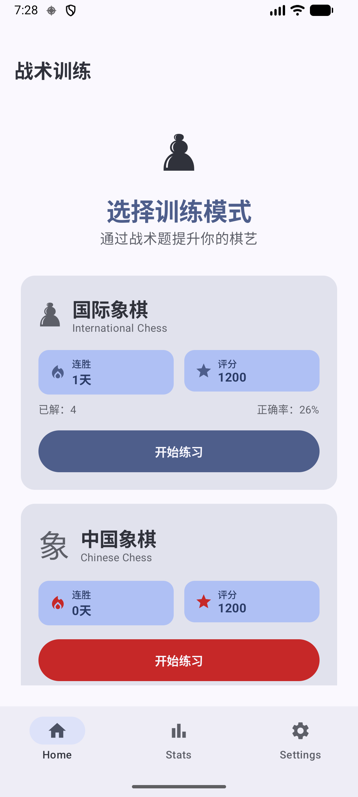
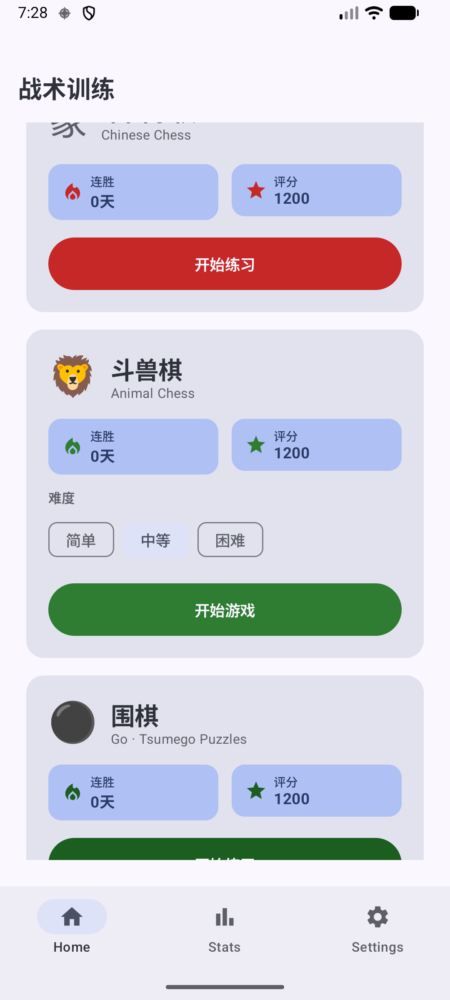
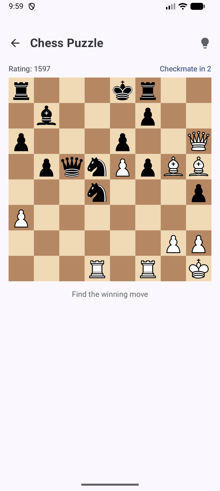
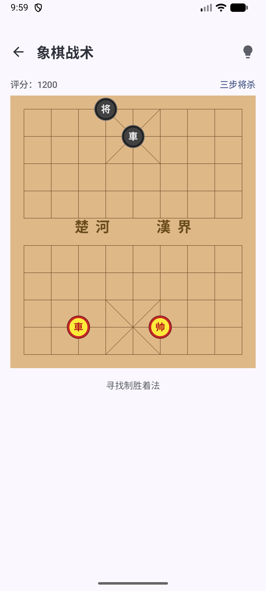
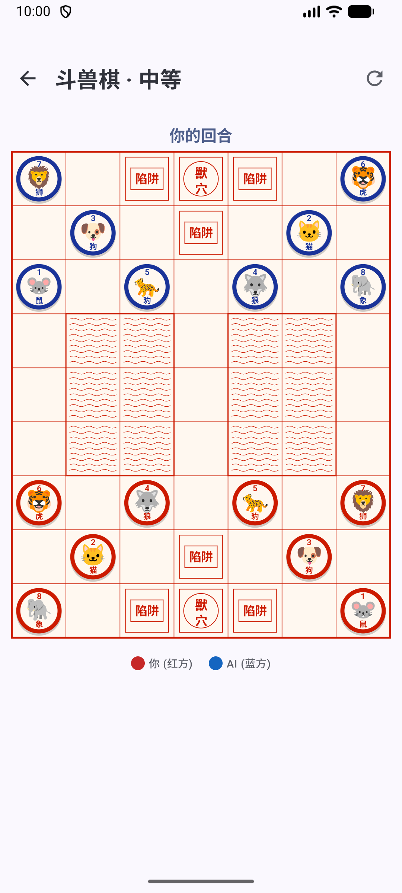
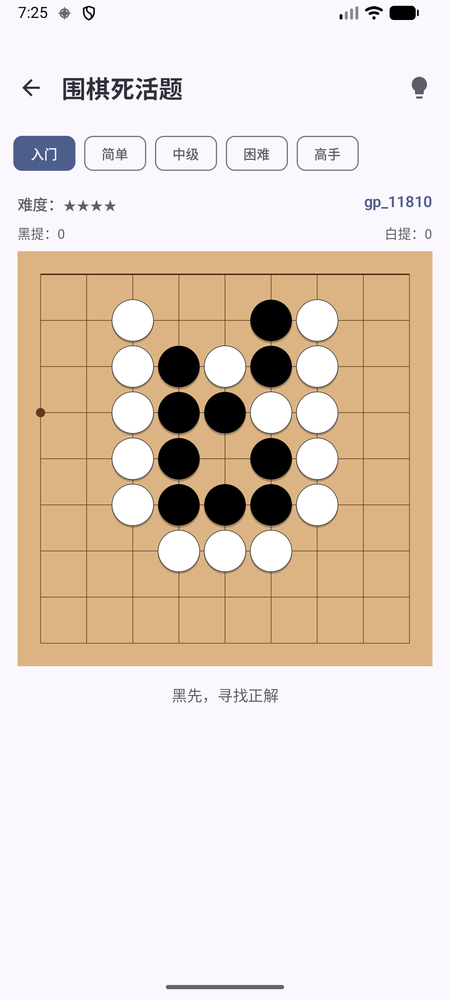
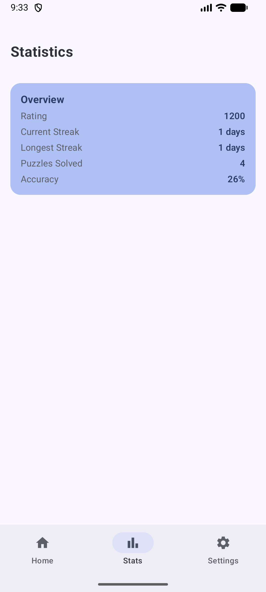
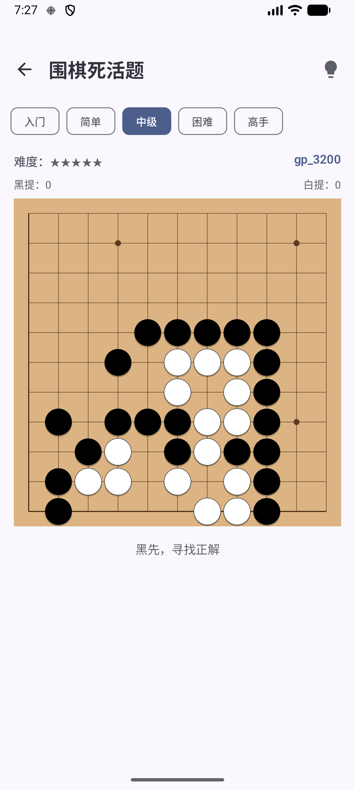

# Chess Tactics Trainer

An Android app for practising chess tactics across four game modes: International Chess puzzles sourced live from Lichess, Chinese Chess (Xiangqi) puzzles, a full Animal Chess (斗兽棋 / Dou Shou Qi) game against an on-device AI opponent, and Go / Tsumego (围棋死活题) life-and-death puzzles.

## Screenshots

### Home Screen
| All modes (top) | Animal Chess & Go Puzzle cards |
|:---:|:---:|
|  |  |

### Game Modes
| International Chess | Chinese Chess (象棋) | Animal Chess (斗兽棋) | Go Tsumego (围棋) | Stats |
|:---:|:---:|:---:|:---:|:---:|
|  |  |  |  |  |

### Go Puzzle — Viewport Zoom
| Beginner (9×9 / small board) | Intermediate (19×19 zoomed into action) |
|:---:|:---:|
|  |  |

## Features

### International Chess
- **Live puzzles** — fetches rated puzzles from the Lichess public API (no account required)
- **Interactive board** — tap to select and move pieces; board flips so your pieces are always at the bottom
- **Multi-move puzzles** — computer replies are played automatically after each correct move
- **Hints & solution** — reveal the piece to move or show the full solution on the board
- **AI Coach** — after completing or failing a puzzle, request a GPT-powered explanation of the tactic

### Chinese Chess / Xiangqi (象棋)
- **Tactical puzzles** — Xiangqi puzzles sourced from the Pychess API
- **Custom Kotlin engine** — full Xiangqi rule engine with UCCI move notation
- **SVG pieces** — traditional Chinese Chess pieces rendered from vector assets
- **Puzzle progress tracking** — streak, rating, and accuracy stored locally

### Animal Chess / Dou Shou Qi (斗兽棋)
- **Play vs AI** — full 8-piece game against an on-device minimax AI with alpha-beta pruning
- **Three difficulty levels** — Easy (depth 2), Medium (depth 4), Hard (depth 6), selectable from the home screen
- **Traditional board design** — woodblock-print style: red ink on cream paper, wavy water lanes, seal-stamp dens (獸穴) and traps (陷阱)
- **Rank & name on pieces** — each piece shows its rank number (1–8), animal emoji, and Chinese character
- **Correct starting layout** — standard mirror-image setup (Blue/Red sides are left-right reflections)
- **Offline & no API key needed** — AI runs entirely on-device; no network required

### Go / Tsumego (围棋死活题)
- **Life-and-death puzzles** — tsumego sourced live from goproblems.com (no account required)
- **SGF parser** — recursive-descent SGF parser handles multi-branch solution trees; supports `AB`/`AW` setup stones, `B`/`W` moves, `SZ`, `PL`, and board-size inference when `SZ` is absent
- **Five difficulty tiers** — 入门 / 简单 / 中级 / 困难 / 高手 (Beginner through Expert), switchable mid-session
- **Viewport zoom** — board automatically zooms into the active area so stones are always large and readable, even on a 19×19 grid
- **Branching solution tree** — all correct variations are accepted; only the marked main line is highlighted as a hint or shown in "Show Solution"
- **Hints & Show Solution** — hint reveals the next stone to play; Show Solution restores the board and highlights the correct move even mid-puzzle
- **AI Coach** — after completing or failing, request a GPT-powered explanation of the tesuji in Chinese

### General
- **Stats tracking** — solve streak, rating, and accuracy per game mode stored in DataStore
- **Background prefetch** — Chess puzzles are cached ahead of time so there's no wait between rounds

## Tech Stack

| Layer | Library / Approach |
|---|---|
| UI | Jetpack Compose + Material 3 |
| Navigation | Navigation Compose |
| Chess engine | [chesslib](https://github.com/bhlangonijr/chesslib) 1.3.3 |
| Xiangqi engine | Custom Kotlin engine (UCCI notation) |
| Animal Chess engine | Custom Kotlin engine + minimax AI (alpha-beta pruning) |
| Go engine | Custom Kotlin engine (liberty counting, capture, ko detection) |
| Go puzzle format | Custom recursive-descent SGF parser with branching solution trees |
| Networking | Retrofit + OkHttp + Moshi |
| Local storage | DataStore Preferences |
| Background work | WorkManager |
| DI | Manual `AppContainer` service locator (no Hilt/KSP — AGP 9.x compat) |
| AI Coach | OpenAI Chat Completions API (optional) |

## Getting Started

### Prerequisites

- Android Studio Meerkat or later
- Android SDK 37 (minSdk 37)
- An OpenAI API key (optional — AI Coach is disabled if the key is absent)

### Setup

1. Clone the repository:
   ```bash
   git clone https://github.com/your-username/ChessTacticsTrainer.git
   ```

2. Create `local.properties` in the project root (this file is gitignored):
   ```properties
   sdk.dir=/path/to/your/Android/Sdk
   OPENAI_API_KEY=sk-...
   ```
   Omit `OPENAI_API_KEY` or leave it blank to run without AI Coach.

3. Open the project in Android Studio and run on a device or emulator (API 37+).

## Architecture

```
app/
├── data/
│   ├── local/          # DataStore: puzzle cache, progress, theme stats; GoSgfParser (SGF → GoPuzzle)
│   ├── mapper/         # Lichess API DTO → domain model (self-correcting FEN reconstruction)
│   ├── remote/         # Retrofit services for Lichess, Pychess, goproblems.com, and OpenAI
│   └── repository/     # PuzzleRepositoryImpl, XiangqiPuzzleRepositoryImpl, GoPuzzleRepositoryImpl, …
├── di/
│   └── AppContainer.kt # Service locator wired in Application class
├── domain/
│   ├── engine/         # ChessEngine, XiangqiEngine, AnimalChessEngine, GoEngine interfaces
│   ├── model/          # Puzzle, BoardState, GoPuzzle, GoSgfNode, GoPoint, UserProgress, …
│   ├── repository/     # Repository interfaces
│   └── usecase/        # GetNextPuzzle, ValidateMove, GetAiExplanation, GetNextGoPuzzle, …
├── engine/
│   ├── ChessLibEngine.kt        # chesslib adapter
│   ├── XiangqiEngineImpl.kt     # Full Xiangqi rule engine
│   ├── AnimalChessEngineImpl.kt # Full Dou Shou Qi rule engine
│   ├── AnimalChessAI.kt         # Minimax + alpha-beta pruning AI
│   └── GoEngineImpl.kt          # Go engine: stone placement, capture, liberty counting, ko
└── presentation/
    ├── board/          # ChessBoardComponent, XiangqiBoardComponent, AnimalBoardComponent,
    │                   # GoBoardComponent (Canvas, viewport zoom), GoUiBoardState, GoViewport
    ├── home/           # Home screen with per-mode stats and difficulty selector
    ├── puzzle/         # PuzzleScreen, XiangqiPuzzleScreen, AnimalGameScreen,
    │                   # GoPuzzleScreen + ViewModels
    ├── stats/          # Per-theme stats screen
    └── settings/       # Settings screen
```

## Animal Chess Rules (Dou Shou Qi)

| Piece | Rank | Special ability |
|---|---|---|
| 鼠 Mouse | 1 | Beats Elephant (rank 8); only piece that can enter water |
| 猫 Cat | 2 | — |
| 狗 Dog | 3 | — |
| 狼 Wolf | 4 | — |
| 豹 Leopard | 5 | — |
| 虎 Tiger | 6 | Jumps over contiguous water lanes (blocked by Mouse in water) |
| 狮 Lion | 7 | Jumps over contiguous water lanes (blocked by Mouse in water) |
| 象 Elephant | 8 | Cannot capture Mouse |

- Higher rank captures lower rank (except Mouse beats Elephant).
- A piece on an **enemy trap** has effective rank 0 and can be captured by anything.
- Enter the opponent's den (獸穴) to win.
- Standard starting layout: each side is a left-right mirror image of the other.

## Puzzle Format (Chess)

Puzzles are fetched from `GET /api/puzzle/next`. The Lichess response includes a full game PGN and `initialPly`. The mapper reconstructs the puzzle starting FEN by trying offsets around `initialPly` and selecting the position where `solution[0]` is a legal move.

Solution moves: even indices (0, 2, 4, …) are the player's moves; odd indices (1, 3, 5, …) are the computer's replies.

## License

MIT
